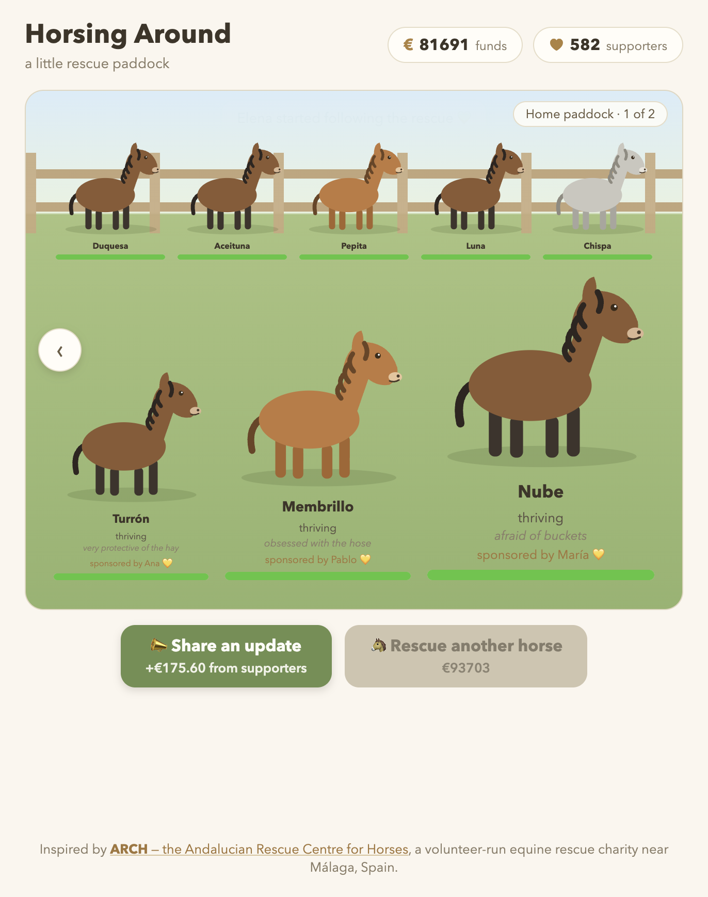

# 🐴 Horsing Around

A little incremental clicker about caring for rescue horses — built to raise awareness (and a bit of real money) for [ARCH, the Andalucian Rescue Centre for Horses](https://www.horserescuespain.org/), a volunteer-run equine rescue charity near Málaga, Spain.

**[Play it live →](https://formerhermit.github.io/HorsingAround/)**



## The idea

Real rescues run on a simple, unglamorous loop: care for an animal, people notice and start supporting the rescue, that support pays for the next animal's care. This game tries to model that loop honestly rather than just being a horse-themed number-go-up toy — care never generates money directly, because in real life kindness doesn't get monetised, fundraising does.

The tone is meant to be earnest first, silly second — horses have real, if whimsical, personality quirks (afraid of buckets, obsessed with the hose), but the game never tips into full absurdist reskin territory.

## Game mechanics

### Care

Clicking a horse raises its **wellbeing** (0–100) by 2 per click. That's the entire care loop — no cost, no cooldown, just attention. Wellbeing drives three things: the horse's colour (visibly perks up from a dull "scruffy" palette to a rich "healthy" one as it recovers), a condition label, and eventually money and sponsorship (below).

| Wellbeing | Label |
|---|---|
| 0–19 | just arrived — needs a lot of care |
| 20–39 | in rough shape |
| 40–59 | recovering |
| 60–79 | doing well |
| 80–94 | content |
| 95–100 | thriving |

At **40 wellbeing** a horse's personality trait is revealed (picked from a pool of 29 quirks, e.g. "convinced the wheelbarrow is a rival"). At **80 wellbeing**, the very first horse to get there in a playthrough triggers the game's first-ever donation — €12, and this is what unlocks the money UI in the first place. At **95 wellbeing** ("thriving"), a horse earns a permanent sponsor (see below).

### Funds (€)

Funds come from four sources:

- **First donation** — a one-off €12 the moment any horse first reaches "content" (80 wellbeing). This is the only money tied to a click, and it only ever happens once per playthrough.
- **Passive supporter income** — every supporter donates €0.15/second, all the time, in the background.
- **Sponsor income** — every horse with a sponsor brings in an *additional* €0.40/second, permanently, stacking on top of general supporter income.
- **Share an update** (the active income lever) — a button the player presses; each press brings in `€1 + €0.30 × current supporters`. This is deliberately the only way clicking generates money: care is free and unlimited, asking for support is a distinct action with its own payoff. The more supporters you've earned, the more each ask is worth.

Funds are spent on exactly one thing: **rescuing a new horse**. The cost escalates with herd size — `€25 × 1.8^(horses − 1)` — so the 2nd horse costs €25, the 3rd ~€45, the 4th ~€81, and so on. There's no way to spend money on anything else (no upgrades yet — see Roadmap).

### Supporters (followers)

Supporters start at 0 and jump to 1 the moment the first donation fires. After that they grow two ways:

- **Passively**, as happy horses attract attention. Every horse contributes a chance-per-second based on its own wellbeing tier (≥95: highest pull, ≥70: medium, ≥50: low, below 50: none), and every horse's contribution adds to the herd total — so a well-cared-for herd's supporter growth compounds, while a single neglected new arrival doesn't drag anyone else down.
- **On sponsorship** — whenever a horse gets a sponsor, that sponsor also counts as +1 supporter.

Supporters matter twice over: they generate passive income directly (€0.15/s each) *and* they raise the value of every "share an update" click, so growing your support base compounds in two directions at once.

### Sponsorship

The first time any horse reaches 95 wellbeing ("thriving"), it's permanently assigned a random sponsor (drawn from a pool of real-sounding first names) who pays €0.40/second forever, on top of everything else. This is the game's main "long-term investment" payoff — a horse you've fully nursed back to health keeps paying dividends for the rest of the playthrough, which is the whole point of rescuing more horses rather than just clicking on one forever.

The very first sponsorship of a playthrough shows a full explanation ("*so-and-so is so taken with [horse] that they've set up a sponsorship — steady support, every month*"). Every sponsorship after that just announces itself tersely ("*so-and-so has sponsored [horse]*") — once the player knows what it means, the game gets out of the way.

### Rescuing new horses

The "Rescue another horse" button unlocks via a small story beat: 8 seconds after the first donation, if the player still only has one horse, the game nudges them ("horses are herd animals — no horse should be alone"). Each rescue costs the escalating fee above and arrives in worse shape than Biscuit (the starting horse) did — wellbeing 4–7 rather than 12 — so later horses are a slightly bigger care investment, not just a bigger bill.

New arrivals get a random name and personality trait from finite pools (currently 96 names, 29 traits), each avoiding duplicates already in the herd where possible — so no two horses in your paddock share a name until you've rescued more horses than there are names left.

### The paddock

Horses aren't just a list — the newest 3 stand in the foreground at decreasing scale (as if closer to the viewer), and once you've rescued more than that, older horses move to a smaller background row, then page off into additional paddocks (navigable with the edge arrows) once a single paddock holds more than 8. The point is that early horses you rescued don't disappear — they're still there, just further back, the way a real growing herd would be.

## Supporting the real ARCH

This game doesn't try to be ARCH's fundraising page — it's a small, honest nudge toward the real one. A quiet banner (not a popup, no shadow or attention-grabbing styling — matches the rest of the game's flat look) appears at most twice per player: once as a story beat shortly after their first sponsorship, and again if they return after a 12+ hour break. It links straight to [ARCH's Donorbox page](https://donorbox.org/donate-to-arch?amount=10). There's also a permanent, low-key Donate link in the footer for anyone who goes looking. Nothing in the game embeds ARCH-specific content that could go stale — the only real-world fact baked in is that URL.

## Tech

Vanilla HTML/CSS/JS, no build step, no framework. Structure:

```
index.html       page shell
css/style.css     all styling
js/state.js       gameState shape + localStorage persistence
js/game.js        game rules and economy tuning
js/horse.js       the parameterised SVG horse illustration
js/render.js      pure state → DOM rendering
js/main.js        boot sequence, input wiring, simulation tick
js/cloud.js       optional Supabase cloud save sync
js/config.js      Supabase project credentials (safe to commit — RLS-protected)
supabase/schema.sql  database setup for cloud saves
```

Cloud sync is entirely optional and additive: the game is fully playable on localStorage alone, and only reaches out to Supabase if `js/config.js` has real credentials in it.

### Running locally

No dependencies, no build. Just serve the directory and open it:

```
python3 -m http.server 8642
```

Then visit `http://localhost:8642`. Append `?reset` to the URL to discard any local save during development.

### Cloud saves (optional)

1. Create a Supabase project.
2. Run `supabase/schema.sql` in the SQL editor.
3. Enable anonymous sign-ins (Authentication → Sign In / Providers → Anonymous Sign-Ins).
4. Drop your project URL and publishable key into `js/config.js`.

Row-Level Security scopes every save to its own anonymous user, so players never see each other's data.

## Roadmap

- Real ARCH horse milestones (an actual current ARCH horse's story, surfaced in-game)
- Cosmetic unlocks (halters, flowers) as a coin sink beyond rescuing
- Return-visit rewards for a slowly filling pasture
