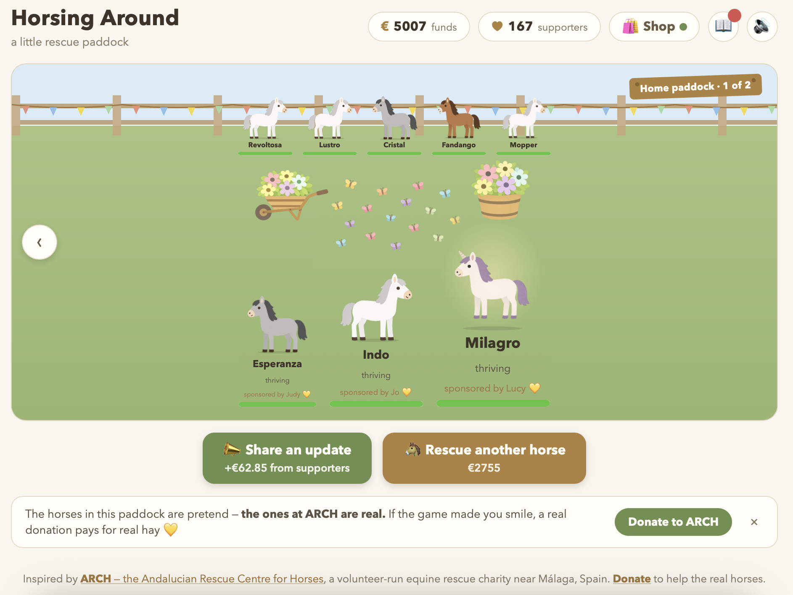

# 🐴 Horsing Around

A little game about looking after rescue horses. It's here to raise a smile, and a bit of real money, for [ARCH, the Andalucian Rescue Centre for Horses](https://www.horserescuespain.org/), a volunteer-run horse rescue near Málaga, Spain.

**[Play it live →](https://formerhermit.github.io/HorsingAround/)**




## The idea

Real rescues run on a simple loop. You care for an animal. People notice and start supporting the rescue. That support pays for the next animal. Repeat.

Money comes from fundraising. Looking after your horses is what wins that support in the first place.

The horses have real little quirks. One's afraid of buckets, another's obsessed with the hose.

## How to play

### Look after your horses

Tap a horse to care for it. Every tap nudges its **wellbeing** up a bit. Tap as much as you like.

As a horse recovers, it visibly perks up: a dull, scruffy coat turns rich and healthy, and its status changes.

| Wellbeing | Status |
|---|---|
| 0–19 | just arrived, needs a lot of care |
| 20–39 | in rough shape |
| 40–59 | recovering |
| 60–79 | doing well |
| 80–94 | content |
| 95–100 | thriving |

A few things happen along the way. Around **40**, a horse's personality shows through. At **80**, the first horse to get there earns your very first donation (€12), which opens up the money side of the game. At **95** ("thriving"), a horse gets a sponsor for life.

### Money

Money comes in a few ways:

- **Your first donation**: a one-off €12 the first time any horse reaches "content". It only ever happens once.
- **Supporters**: everyone following the rescue chips in €0.15 a second, all the time, in the background.
- **Sponsors**: every horse with a sponsor brings in an extra €0.40 a second, forever, on top of that.
- **Share an update**: a button you press to ask for support. Each press is worth `€1 + €0.30 for every supporter`. The more people follow you, the more each ask brings in.

You spend money on two things: **rescuing more horses** and **the shop**.

### Supporters

Supporters start at zero, and jump to one the moment that first donation lands. After that, happy horses attract more of them: the better your herd's doing, the faster your following grows. Every new sponsor counts as a supporter too.

Supporters pull double duty. They donate on their own, and they make every "share an update" worth more. So growing your following pays off twice.

### Sponsors

The first time a horse hits 95 wellbeing, someone falls for it and becomes its sponsor, paying €0.40 a second, forever. A horse you've nursed all the way back keeps paying its way.

### Rescue more horses

Once your first horse is settled, the game nudges you to bring home a friend. No horse should be alone. Each rescue costs a bit more than the last, and new arrivals turn up in rougher shape than the first.

One rule: you can't rescue a new horse if it would push a horse that **isn't thriving yet** to the back of the paddock. Look after the ones you've got first.

### Rehome horses

Every so often, a thriving horse is ready for a forever home. You'll get an offer with a small adoption fee (roughly 10% of your next rescue's cost). Say **yes** and the horse trots off happily and the fee goes into your fund. Say **not now** and they stay put. Offers stop once you're down to two horses, so the paddock never empties out.

### The shop

Spend your funds on nice things.

- **Wardrobe**: scarves, boots, flowers and bows for a chosen horse. A dressed-up horse turns more heads, so it attracts supporters faster.
- **Paddock decor**: bunting, flower buckets, hay bales, a water trough, even a dog or a cat. Decor makes every "share an update" worth more.

Each paddock gets its own decorations, up to a tidy limit. Some choices are one or the other: flower garland *or* bunting, an ear flower *or* a forelock bow. The dog and cat are the big splurges, for when the rescue's really thriving.

### Rare coats

Most rescues arrive in one of five everyday coats. Just occasionally, a rarer one turns up: a **spotted** pony, a **chestnut**, or a **piebald**. They're uncommon on purpose (roughly a one-in-ten surprise on a rescue), and they wear a soft shiny shimmer to set them apart.

### The collection book

Tap the book up top to open your collection: every coat there is to find, which ones you've already welcomed home, and dimmed silhouettes for the ones you haven't. It fills in as your rescue grows.

### Little celebrations

The game cheers you on. Hit 5, 25, 50 (and beyond) rescues, or rehomings, and you'll get a pat on the back and a bit of extra cash. Reach 10 rescues and there's confetti, plus a gentle nudge toward the real ARCH, with a magical friend in it for you if you help (more on that below).

### The paddock

The newest three horses stand up front, and older ones move to the back as the herd grows, then into extra paddocks you can flick between. Nobody disappears. The horses you rescued early are still there, just further back.

## Helping the real ARCH

The horses in the game are pretend, but ARCH's are real. A quiet banner shows up at most twice: once shortly after your first sponsor, and again if you come back after a long break. It links straight to [ARCH's donation page](https://donorbox.org/donate-to-arch?amount=10), and there's a low-key Donate link in the footer too, always there if you go looking.

Around your tenth rescue, the game offers a **unicorn**. Donate to the real rescue and a one-of-a-kind magical friend comes to live in your paddock, shimmering away and quietly charming new supporters. It's honour-based, on the donate click, and it's a gift, so it never counts toward a rescue's cost. And it's not a single missable moment: if you wave off that first offer, tapping any Donate button brings it back, so the unicorn stays winnable.

## Under the hood

Plain HTML, CSS and JavaScript. No build step, no framework.

```
index.html             the page
css/style.css          all the styling
js/state.js            what the game knows, plus saving to your browser
js/game.js             the rules and the money maths
js/shop.js             shop items and their rules
js/horse.js            the horse illustration, drawn in code
js/render.js           turns the game state into what you see on screen
js/main.js             starts it all up and handles your taps
js/audio.js            the background music
js/cloud.js            optional cloud-save syncing
js/config.js           Supabase keys (safe to commit, protected by RLS)
assets/                horse art and decor images
audio/soundtrack.mp3   the music
supabase/schema.sql    database setup for cloud saves
```

Your progress saves to your browser on its own. Cloud saving is optional. The game runs on browser storage alone, and only talks to Supabase if `js/config.js` has real keys in it.

### Run it locally

Nothing to install. Serve the folder and open it:

```
python3 -m http.server 8642
```

Then visit `http://localhost:8642`. Add `?reset` to the URL to wipe your local save while you're tinkering.

### Cloud saves (optional)

1. Create a Supabase project.
2. Run `supabase/schema.sql` in the SQL editor.
3. Turn on anonymous sign-ins (Authentication → Sign In / Providers → Anonymous Sign-Ins).
4. Pop your project URL and publishable key into `js/config.js`.

Every save is scoped to its own anonymous user, so players never see each other's data.

## What's next

- Leaderboard
